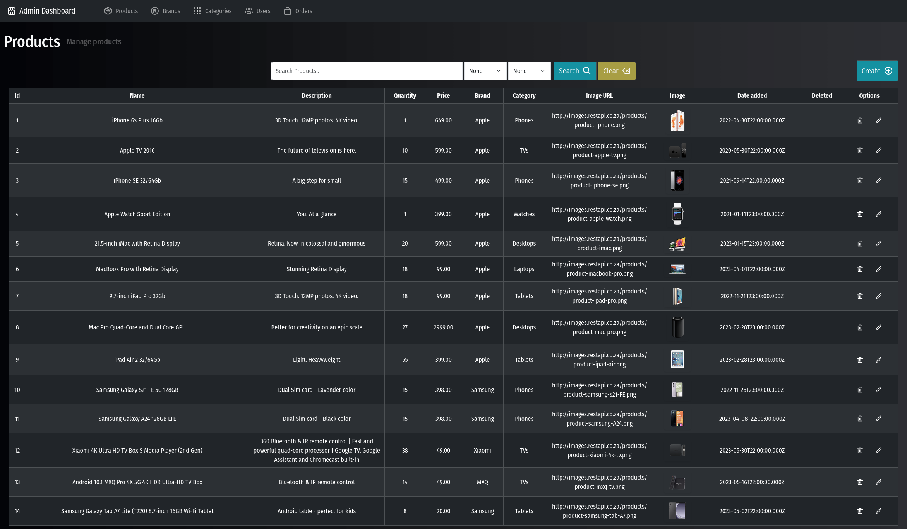
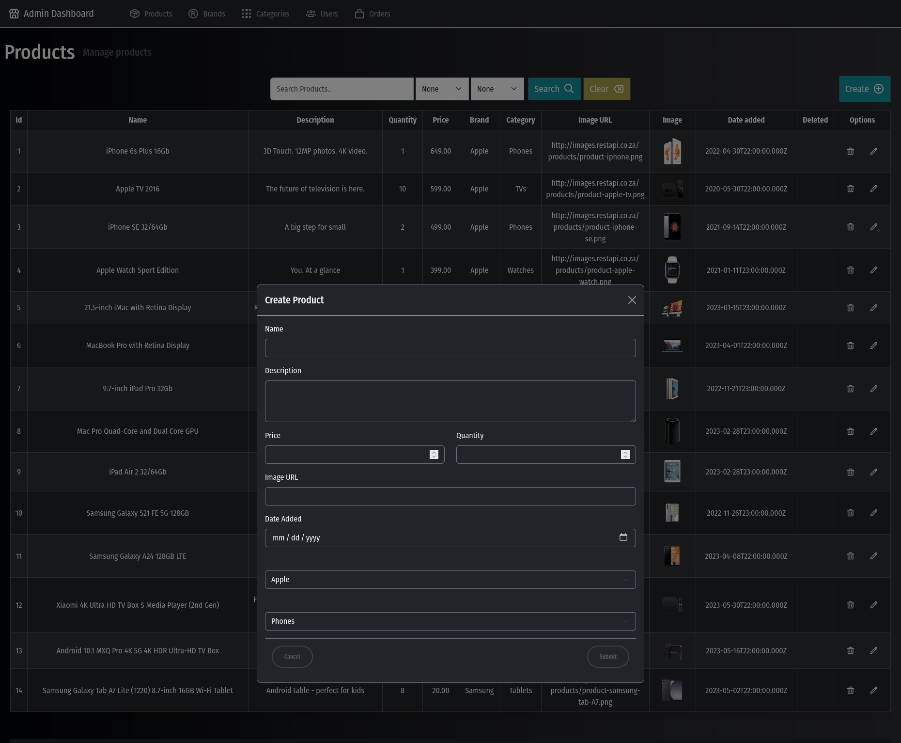
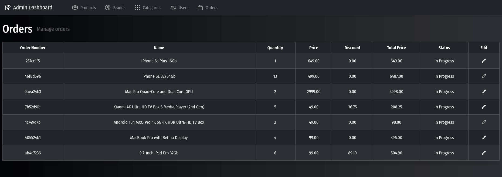
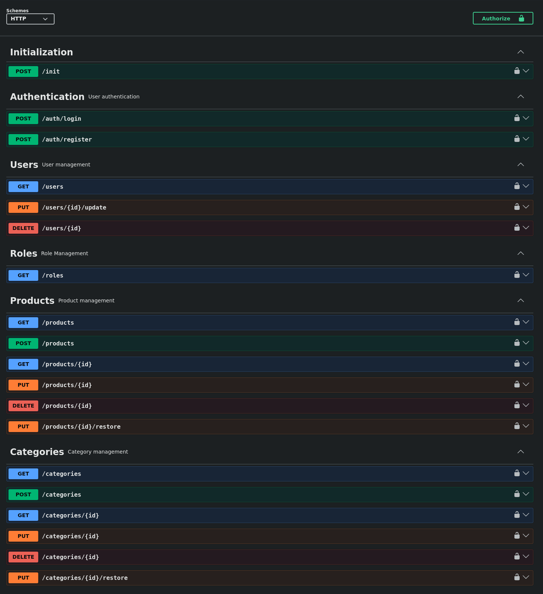

# E-commerce Full-Stack Admin Dashboard


Full stack e-commerce admin dashboard application built using [Node.js](http://Node.js), Express, Sequelize and MySQL.

## Table of Contents

- [Installation](#installationsetup)
- [Features](#features)
- [Environment Variables](#configure-environment-variables)
- [Screenshots](#screenshots)
- [Libraries/Packages](#librariespackages)

### Features

- JWT Authentication and role-based authorization
- Product, Brand and Category management
- User and Order management
- Membership discounts
- Transactional checkout process
- Soft delete and restore functionality
- Swagger API documentation
- Responsive Bootstrap admin dashboard  

## Screenshots

### Login Page

<p align="center">
  
</p>

### Products Dashboard

<p align="center">
  
</p>

### Create Product Modal

<p align="center">
  
</p>

### Orders Dashboard

<p align="center">
  
</p>

### Swagger Documentation

<p align="center">
  
</p>


# Installation/setup

### Install dependencies
---

Install dependencies in both back-end and front-end folders.

Back-end:
```bash
cd back-end  
npm install
```
Front-end:
```bash
cd front-end  
npm install
```
### Configure environment variables
---

Create a .env file in the root of the project:
```env
HOST=localhost  
ADMIN_USERNAME=your_username  
ADMIN_PASSWORD=your_password  
DATABASE_NAME=database_name  
DIALECT="mysql"  
DIALECTMODEL=mysql2  
BACK_PORT=3000  
FRONT_PORT=3001  
API_URL=http://localhost:3000  
TOKEN_SECRET=your_token_secret  
SESSION_SECRET=your_session_secret
```

### Create the database
---

Create a MySQL database matching your .env file.

Example:
```sql
CREATE DATABASE ecommerce_admin
```
### Initialize the database
---

Initialize the database before using the application.  
Start the back-end server:
```bash
npm start
```
Then initialize the database using either:

**Swagger:**

http://localhost:3000/doc

Execute the POST /init endpoint.

**Postman**  
Send a POST request to:

http://localhost:3000/init

### Start the application
---

Start the back-end server:
```bash
cd back-end  
npm start
```
Open a second terminal and start the front-end server:
```bash
cd front-end  
npm start
```
### Access the application
---

Admin dashboard:  
http://localhost:3001

Swagger documentation:  
http://localhost:3000/doc

### Administrator account
---

The seeded admin account can be used to access the dashboard:

| Role | Email | Password |
|--------|--------|--------|
| Admin | admin@noroff.no | P@ssword2023 |

### Running tests
---

From the back-end folder:
```bash
npm test
```
# .env example

```env
HOST=localhost  
ADMIN_USERNAME=admin  
ADMIN_PASSWORD=adminpassword  
DATABASE_NAME=Example_Database  
DIALECT="mysql"  
DIALECTMODEL=mysql2  
BACK_PORT=3000  
FRONT_PORT=3001  
API_URL=http://localhost:3000  
TOKEN_SECRET=secret_token  
SESSION_SECRET=something_secret
```

# Libraries/Packages

| Package                | Purpose                                                       |
|------------------------|---------------------------------------------------------------|
| **express**            | Web framework for building the API endpoints.                 |
| **express-session**    | For managing user sessions and storing session data.          |
| **axios**              | To make requests to external API.                             |
| **dotenv**             | Loads environment variables from .env file                    |
| **jsend**              | Standardizes the API responses in success/fail/error format. |
| **jsonwebtoken**       | To generate and verify JWT tokens for authentication          |
| **mysql**              | To store and manage application data.                         |
| **mysql2**             | MySQL driver used by Sequelize                                |
| **sequelize**          | ORM for interacting with the MySQL database.                  |
| **swagger-autogen**    | Generated Swagger documentation from Express routes.          |
| **swagger-ui-express** | Serves the API documentation interface.                       |
| **uuid**               | Generates unique identifiers for orders and transactions.     |
| **jest**               | Testing framework for unit and integration tests.             |
| **supertest**          | Testing HTTP endpoints.                                       |
| **nodemon**            | To automatically restart the app when changes are made.       |
| **bootstrap**          | CSS framework used to create responsive layout.               |
| **sweetalert**         | For creating customizable alert messages.                     |

# Node version

V22.17.0

